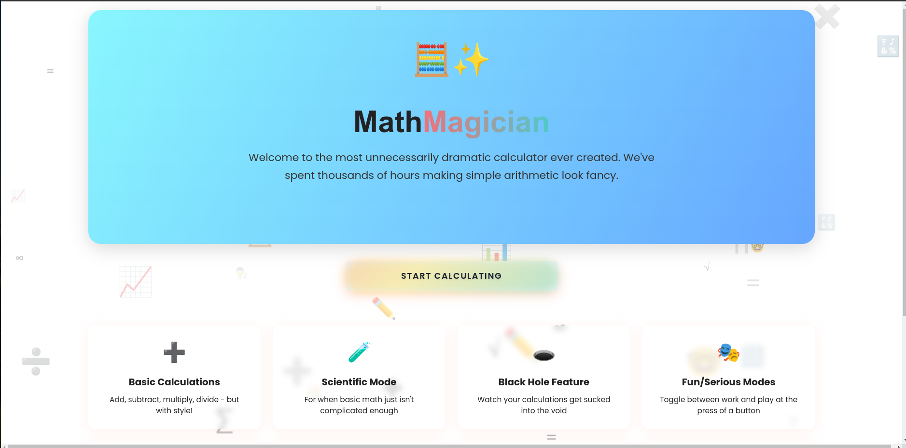
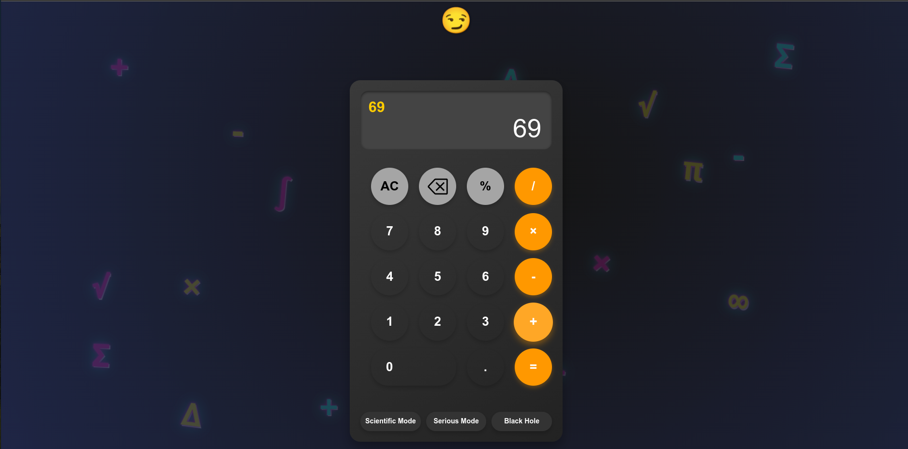

# Interactive Calculator

A feature-rich calculator with both basic and scientific modes, complete with fun easter eggs and hidden messages.

## Screenshots


*Basic Mode Interface*


*Scientific Mode Interface*


## Features

### Basic Operations
- Addition (+)
- Subtraction (-)
- Multiplication (×)
- Division (÷)
- Percentage (%)
- Decimal point (.)
- Clear (C)
- Backspace (⌫)
- Toggle positive/negative (±)
- Parentheses ( ( ) )

### Scientific Operations
- Square root (√)
- Square (x²)
- Sine (sin)
- Cosine (cos)
- Tangent (tan)
- Logarithm (log)
- Natural logarithm (ln)
- Pi (π)

### Special Features
- Mode toggle (Basic/Scientific)
- Serious mode toggle (removes emojis)
- Black hole effect
- Dynamic emoji reactions
- Loading screen with progress bar
- Responsive design

## Easter Eggs and Hidden Messages

### Number Combinations
- `69 or result equal to 69` - Triggers a special meme and sound effect
- `420` - Special emoji reaction
- `5318008` - Classic calculator easter egg (BOOBIES upside-down)
- `42` followed by `0` - Special emoji reaction
- `5` - Special handling when entered first

### Special Results
- Results > 10,000 - Triggers a financial advisor message
- Perfect whole numbers - Special celebration emoji
- Error states - Special error emoji

### Special Modes
- Serious Mode - Removes all emojis and fun elements
- Black Hole Mode - Creates a special animation effect

## Getting Started

1. Clone the repository
2. Install dependencies:
   ```bash
   npm install
   ```
3. Start the development server:
   ```bash
   npm start
   ```

## Dependencies
- React
- CoreUI Icons
- React Router

## Project Structure
```
src/
├── App.js         # Main calculator component
├── App.css        # Main styles
├── HomePage.js    # Home page component
├── HomePage.css   # Home page styles
├── Card.js        # Card component
├── Card.css       # Card styles
└── index.js       # Application entry point
```

## Contributing
Feel free to submit issues and enhancement requests!
